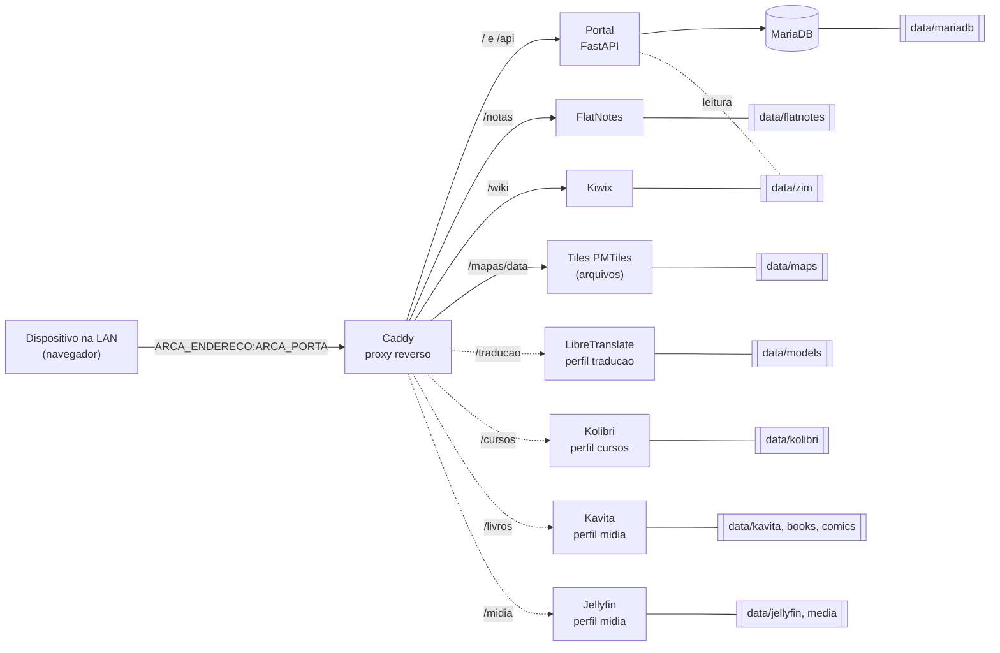

<p align="center">
  <picture>
    <source media="(prefers-color-scheme: dark)" srcset="docs/assets/logo-vertical-escuro.svg">
    
  </picture>
</p>

# Arca

Servidor de conhecimento **100% offline**, auto-hospedado, em Docker Compose. Um único endereço na rede local
dá acesso, pelo navegador de qualquer dispositivo, a notas, Wikipédia, mapas, tradutor, cursos, livros,
quadrinhos, filmes e música. Funciona em x86_64 com 8 GB ou mais de RAM.

## O que é e por quê

O Arca nasceu para o cenário de crise, o "mundo pós-apocalíptico" brasileiro: sem internet, com a rede
elétrica instável, mas com um computador e alguns celulares ligados na mesma rede local. Você prepara tudo
**antes**, uma vez, numa máquina com internet; depois o servidor roda sem nunca precisar de internet.

O público-alvo são brasileiros sem inglês técnico. Por isso o projeto inteiro é em português: interface,
comandos, variáveis, rotas da API, banco de dados e documentação (regras em [CLAUDE.md](CLAUDE.md)).

> **AVISO DE SEGURANÇA - leia antes de instalar**
>
> - O Arca **não tem autenticação** (nem login, nem senha nos serviços expostos, nem HTTPS).
>   Quem alcançar a porta pode ler e **alterar** notas e favoritos.
> - Use **somente em rede local (LAN) confiável**. Nunca exponha a porta à internet (sem
>   port-forward, sem IP público, sem túnel).
> - Por isso o Caddy publica a porta só no IP definido em `ARCA_ENDERECO`. O `make ambiente` preenche
>   com o IP da LAN detectado; `127.0.0.1` significa "só esta máquina". **Não use `0.0.0.0`**
>   em máquina com IP público.
> - Só o Caddy publica porta no host; MariaDB e os demais serviços ficam na rede interna do Compose.
> - Jellyfin, Kavita e Kolibri têm assistente de primeiro acesso que cria um usuário administrador.
>   Isso protege a administração desses apps, mas o Arca como um todo continua aberto na LAN.

## Serviços, rotas e perfis

O núcleo (portal, MariaDB, FlatNotes, Kiwix e Caddy) sempre sobe. Os perfis opcionais são ligados em
`COMPOSE_PROFILES`, no `.env`.

| Caminho | Serviço | Perfil | Observação |
|---|---|---|---|
| `/` | Portal (painel, favoritos, inventário, ajuda) | núcleo | FastAPI + MariaDB |
| `/notas` | FlatNotes (notas em markdown) | núcleo | arquivos `.md` em `data/flatnotes` |
| `/wiki` | Kiwix (Wikipédia e outros ZIMs) | núcleo | serve todo `data/zim/*.zim` |
| `/mapas/` | Mapas (MapLibre + PMTiles) | núcleo | página do portal; tiles de `data/maps/*.pmtiles` servidos pelo Caddy em `/mapas/data/` |
| `/traducao/` | LibreTranslate (en, pt, es) | `traducao` | precisa dos modelos (`make modelos-traducao`) |
| `/cursos/` | Kolibri | `cursos` | canais baixados com `make baixar-dados` |
| `/livros/` | Kavita (livros e quadrinhos) | `midia` | arquivos em `data/books` e `data/comics` |
| `/midia/` | Jellyfin (filmes e música) | `midia` | `data/media/movies` e `data/media/music` |
| `/api/docs` | Documentação da API do portal (Swagger local) | núcleo | |

API do portal: `GET /api/saude`, `GET /api/servicos`, CRUD em `/api/favoritos` e `GET /api/biblioteca`.
Sem o perfil ligado, a rota responde uma página "Serviço indisponível" (HTTP 503) e o cartão do painel
aparece como `desativado`. Como usar cada serviço: [docs/USO.md](docs/USO.md).

```bash
COMPOSE_PROFILES=traducao,cursos,midia   # traducao = LibreTranslate, cursos = Kolibri, midia = Kavita + Jellyfin
```

## Arquitetura



Linhas tracejadas indicam serviços de perfis opcionais. Todos ficam na rede interna `internal` do Compose;
só o Caddy publica porta no host. O Caddy não depende dos perfis opcionais: resolve o destino na requisição
e, se o serviço não está rodando, devolve a página 503.

### Decisões de arquitetura

- **Caddy como única porta**: um endereço só, rotas por caminho (sem `strip`: cada serviço trata o próprio
  prefixo), HTTPS automático desligado (rede local, sem domínio). Config em [caddy/Caddyfile](caddy/Caddyfile).
- **FastAPI no portal**: API pequena e frontend estático servido pelo próprio portal, sem CDN nem fontes externas.
- **MariaDB só para o portal**: guarda favoritos, catálogo de serviços e configurações. Notas são arquivos
  markdown e o conteúdo pesado (ZIM, mapas, mídia) fica em arquivos; nenhum desses depende do banco.
- **Perfis do Compose**: o núcleo é leve; tradução, cursos e mídia só sobem se você ligar o perfil e tiver RAM.
- **Imagens com versão e digest**: todas as `ARCA_IMAGEM_*` do [.env.example](.env.example) estão fixadas em
  `tag@digest`, para o resultado ser o mesmo no pacote offline.
- **Offline por construção**: o portal é construído com wheels locais (`portal/wheels`), mapas e fontes são
  vendorizados, o LibreTranslate não atualiza modelos e a fumaça verifica a ausência de recurso externo.
  Detalhes e limites do que é testado: [docs/OFFLINE.md](docs/OFFLINE.md#4-como-o-arca-garante-funcionar-offline-e-o-que-o-teste-cobre).

## Estrutura de pastas

| Pasta | Conteúdo |
|---|---|
| `portal/` | API FastAPI, frontend estático, migrações SQL (`migrations/`, reversas em `migrations/down/`) e testes |
| `caddy/` | `Caddyfile` do proxy |
| `jellyfin/`, `kavita/` | sementes de configuração (prefixos `/midia` e `/livros/`) |
| `scripts/` | operação: baixar dados, empacotar, carregar, backup, restaurar, fumaça e teste de operação |
| `docs/` | índice, uso, guia offline, checklist de release e logo (`assets/`) |
| `data/` | dados em execução (MariaDB, notas, ZIMs, mapas, mídia); **fora do versionamento, não edite** |
| `.claude/` | PRDs, specs e aprendizados do projeto |

## Requisitos

- Linux x86_64 (ARM64 não é suportado no MVP), 8 GB de RAM ou mais.
- Docker Engine com o plugin Compose v2 (o arquivo de teste usa `!override`, que exige Compose 2.24 ou mais novo).
- `make`, `curl`, `tar`, `sha256sum`. `python3` só para rodar `make teste`.
- Disco: núcleo + Wikipédia mini + mapa de Belo Horizonte cabem em poucos GB (o ZIM mini tem ~1,7 GB).
  Mídia, livros e canais Kolibri crescem conforme o que você colocar.
- RAM por perfil: [docs/OFFLINE.md](docs/OFFLINE.md#hardware-e-ram-por-perfil).

## Início rápido (com internet)

```bash
cd arca
make ambiente          # cria .env (IP da LAN em ARCA_ENDERECO, UID/GID); troque as senhas do MariaDB
$EDITOR .env           # ARCA_PORTA, senhas, COMPOSE_PROFILES
make baixar-dados      # baixa conteúdo (ZIM, mapa, modelos, Kolibri); PERFIL=mini é o padrão
make subir             # constrói o portal, sobe a stack e espera ficar saudável
```

Abra `http://<IP-da-LAN>:<ARCA_PORTA>/` (com `ARCA_PORTA=80`, sem porta). Sem nenhum `.zim` em `data/zim` o
Kiwix não sobe, e como o Caddy depende dele, a stack também não: rode `make baixar-dados` (ou copie um `.zim`)
**antes** do primeiro `make subir`. Para o nome `arca.local`, veja [docs/USO.md](docs/USO.md#nome-local-arcalocal).

Comandos do dia a dia (a lista completa está no [Makefile](Makefile)):

| Alvo | O que faz |
|---|---|
| `make ambiente` | cria `.env` a partir de `.env.example`, detectando IP da LAN, UID e GID |
| `make subir` | sobe a stack (`docker compose up -d --build --wait`) e cria as pastas de `data/` |
| `make derrubar` | derruba tudo, inclusive perfis opcionais (os dados em `data/` ficam) |
| `make estado` / `make logs` | estado dos containers / logs (`-f`, 100 linhas) |
| `make baixar-dados` | baixa conteúdo (precisa de internet): `PERFIL=mini\|completo ARGUMENTOS='--simular --somente zim,mapas,modelos,kolibri'` |
| `make modelos-traducao` | baixa uma vez os modelos do LibreTranslate (~700 MB, precisa de internet) |
| `make empacotar DESTINO=/caminho` | empacota imagens + dados para instalar offline (`ARGUMENTOS='--perfis nenhum'` = só o núcleo) |
| `make carregar ORIGEM=/caminho` | instala a partir de um pacote (`ARGUMENTOS='--destino DIR --sem-subir'`) |
| `make backup` | backup em `./backups` (ou `DIRETORIO_BACKUP=...`) |
| `make restaurar CONFIRMAR=1` | restaura (exige `CONFIRMAR=1`; `ARQUIVO=...` escolhe o arquivo) |
| `make teste` | todos os testes: convenção, portal, scripts operacionais e fumaça da stack |
| `make teste-convencao` | só a verificação de idioma e links (rápida, sem Docker) |

## Fluxo offline

1. **Máquina com internet**: `make ambiente`, `make baixar-dados`, `make modelos-traducao` (se usar tradução),
   `make subir` para conferir e `make empacotar DESTINO=/media/pendrive/arca-pacote`.
2. **Pendrive** leva o pacote (`imagens.tar`, `projeto.tar`, `dados.tar`, somas e o instalador).
3. **Máquina alvo sem internet** (só Docker, `make`, `tar`, `sha256sum`): `./carregar.sh . --destino /opt/arca`
   dentro da pasta do pacote; depois edite o `.env` (senhas, `ARCA_ENDERECO`, `COMPOSE_PROFILES`).

Passo a passo completo, o que o pacote contém e armadilhas (digest, perfis, FAT32): [docs/OFFLINE.md](docs/OFFLINE.md).

## Backup e restauração

```bash
make backup                       # ./backups/arca-backup-AAAAMMDD-HHMMSS.tar.gz (precisa do MariaDB rodando)
make restaurar CONFIRMAR=1        # usa o backup mais recente; antes salva o banco atual e move as notas
```

O backup contém o banco, as notas, o estado dos apps e a configuração (**inclui o `.env`, com senhas**: guarde
em local seguro); não inclui o conteúdo pesado. Detalhes e limitações: [docs/OFFLINE.md](docs/OFFLINE.md#3-backup-e-restauração).

## Testes

```bash
make teste            # roda os quatro abaixo
make teste-convencao  # termos do glossário em inglês fora das exceções + links relativos do README e de docs/
make teste-portal     # seam 1: pytest da API contra um MariaDB real descartável
make teste-operacao   # seam 2: baixar-dados (checksum, retomada) e backup -> restaurar em projeto limpo
make teste-fumaca     # seam 3: stack inteira numa cópia descartável (porta ARCA_PORTA_FUMACA, padrão 8099)
```

- `teste-portal` cobre `/api/saude`, `/api/servicos`, `/api/favoritos`, `/api/biblioteca` e as migrações.
- `teste-fumaca` valida configuração, healthchecks, rotas, 206 nos tiles, perfis desligados, persistência,
  páginas sem recurso externo e isolamento de rede. Exige ao menos um `.zim` em `data/zim`, só lê esse arquivo e
  não toca no resto de `data/`. Nenhum teste baixa nada da internet (as imagens já precisam estar no Docker).
- `teste-convencao` falha se achar termo do glossário em inglês (CLAUDE.md) em código, SQL, scripts, Makefile, compose ou
  documentação, ou link relativo quebrado. Exceções (nomes impostos por terceiros e nomes antigos citados de propósito)
  ficam em `scripts/convencao-excecoes.txt`, cada uma com justificativa; exceção sem uso também falha.
- Se a porta 80 estiver ocupada: `ARCA_PORTA=8088 make teste`.

Gancho de pré-commit opcional (só a convenção, leva menos de um segundo; o projeto não exige git):

```bash
printf '#!/bin/sh\nexec make teste-convencao\n' > .git/hooks/pre-commit && chmod +x .git/hooks/pre-commit
```

Checklist de publicação: [docs/RELEASE.md](docs/RELEASE.md).

## Identidade visual e paleta

Conceito "arca": cabine de telhado baixo com janela em ferrugem sobre um casco de tábuas curvas, simétrico, com a palavra ARCA em capitais geométricas (versões horizontal e empilhada, claro e escuro). Logo e favicon em
[docs/assets/](docs/assets/) (cópias servidas pelo portal em `portal/app/static/site/imagens/`), todos locais.
Os tokens de cor ficam em `portal/app/static/site/css/style.css`, em português; use os aliases semânticos
(`--fundo`, `--texto`, `--link`, `--acento`...) nas telas novas.

| Token | Cor | Uso |
|---|---|---|
| `--carvao` | `#1C2421` | fundo escuro, texto no tema claro |
| `--musgo` | `#3F5A43` | títulos no tema claro |
| `--folha` | `#7FA363` | títulos e "no ar" no tema escuro |
| `--ferrugem` | `#A8471F` | acento primário e links no tema claro |
| `--brasa` | `#E8873F` | acento e links no tema escuro |
| `--osso` | `#EDE6D6` | fundo claro, texto no tema escuro |
| `--argila` | `#6E5540` | texto suave no tema claro |

Valores ajustados para contraste AA nos dois temas. Ao mudar uma cor, recalcule o contraste antes.

## Limitações

- Sem autenticação e sem HTTPS (veja o aviso de segurança); só LAN.
- x86_64 apenas; ARM64 fora do MVP.
- O nome `arca.local` não é configurado sozinho (sem mDNS/DNS embutido).
- A busca por nome nos mapas só encontra o que já está carregado na tela (PMTiles não tem índice de busca).
- Os perfis opcionais não sobem na fumaça (RAM e imagens grandes); só o redirecionamento e a página 503 deles são testados.
- Downloads do perfil `completo` não foram exercitados de ponta a ponta.
- Lista completa: [docs/USO.md](docs/USO.md#problemas-conhecidos-e-fallback-por-subdomínio) e [docs/OFFLINE.md](docs/OFFLINE.md).

## Licenças de terceiros

O Arca só orquestra software e conteúdo de terceiros, que mantêm suas próprias licenças e termos; confira cada
um antes de redistribuir um pacote: Caddy, MariaDB, FlatNotes, Kiwix (e os arquivos ZIM, como a Wikipédia),
LibreTranslate (e os modelos Argos), Kolibri (e os canais do Kolibri Studio), Kavita, Jellyfin, MapLibre,
PMTiles e os dados de mapa do Protomaps/OpenStreetMap. Conteúdo e interfaces desses apps não são traduzidos
nem alterados pelo projeto.

## Documentação

Índice em [docs/README.md](docs/README.md).
